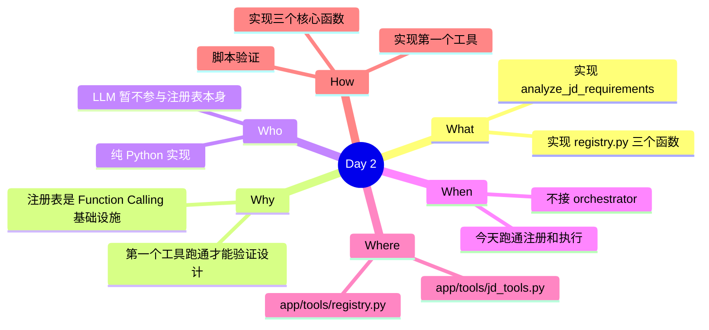

# 第 1 周-第 2 天执行计划：实现注册表 + 第一个工具

## 今日概览

今天实现工具注册表的三个核心函数，并完成第一个工具 `analyze_jd_requirements` 的实现和注册。用脚本直接调用验证，不接 orchestrator。

---

## 任务1：实现 registry.py

**预估难度**：中

### 1.1 register_tool

函数签名：`register_tool(schema: dict, fn: Callable[[dict], dict]) -> None`。从 schema 取 `name` 作为 key，存入全局 `TOOL_REGISTRY`。允许重复注册（覆盖）。

### 1.2 get_tools_for_llm

函数签名：`get_tools_for_llm() -> list[dict]`。遍历 TOOL_REGISTRY，把每项 schema 包装成 `{"type": "function", "function": schema}` 格式，返回列表。格式必须符合 OpenAI `tools` 参数规范。

### 1.3 execute_tool

函数签名：`execute_tool(name: str, arguments: dict) -> dict`。工具不存在时返回 `{"status": "error", "error": "工具 {name} 未注册"}`。工具存在时调用 `fn(arguments)`，捕获所有异常，异常时返回 `{"status": "error", "error": str(e)}`。成功时返回工具函数的原始返回值。

---

## 任务2：实现第一个工具

**预估难度**：中

### 2.1 实现 analyze_jd_requirements

文件：`app/tools/jd_tools.py`。函数签名：`analyze_jd_requirements(arguments: dict) -> dict`。入参检查：缺少 `jd_text` 时返回 `{"status": "error", "error": "缺少必填参数 jd_text"}`。实现：调用 `call_llm`，Prompt 要求返回 `{"requirements": [...], "nice_to_have": [...]}`。LLM 解析失败时返回 `{"status": "error", "error": "解析失败"}`。成功时返回 `{"status": "success", "result": {...}}`。

### 2.2 注册并用脚本验证

在 `app/tools/__init__.py` 里导入并注册工具。写 `scripts/test_tool.py`，验证：`execute_tool("analyze_jd_requirements", {"jd_text": "..."})` 返回结构化结果；`execute_tool("not_exist", {})` 返回错误 dict；`get_tools_for_llm()` 返回长度为 1 的列表且格式正确。

---

## 今天不做什么

- 不修改 orchestrator 和 main.py
- 不实现第二个工具
- 不考虑并行工具调用
- 不写 pytest（脚本验证即可）

## 日终验收

- [ ] registry.py 三个函数实现完毕
- [ ] `analyze_jd_requirements` 能返回结构化结果
- [ ] `execute_tool` 对不存在的工具和异常都能返回错误 dict
- [ ] `get_tools_for_llm()` 返回符合 OpenAI 规范的列表
- [ ] `scripts/test_tool.py` 跑通，输出符合预期
