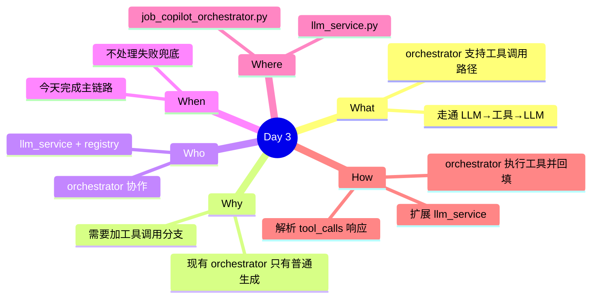

# 第 1 周-第 3 天执行计划：orchestrator 集成工具调用链路

## 今日概览

今天让 orchestrator 能识别 LLM 返回的工具调用意图，执行对应工具，把结果回填给 LLM，得到最终回答。完成「普通生成」和「工具调用」两条路径的分支逻辑。

---

## 任务1：扩展 llm_service

**预估难度**：中

### 1.1 实现 call_llm_with_tools

函数签名：`call_llm_with_tools(system_prompt, user_input, tools, messages_history=[]) -> dict`。发请求时携带 `tools` 参数。检查响应的 `message.tool_calls` 是否存在：有则返回 `{"type": "tool_calls", "tool_calls": [...]}` ；无则返回 `{"type": "text", "content": str}`。

注意：`tool_calls[i].function.arguments` 是 JSON 字符串，调用方需要 `json.loads()` 解析。

### 1.2 实现 call_llm_with_tool_result

函数签名：`call_llm_with_tool_result(messages: list[dict]) -> str`。入参是完整消息列表（含工具结果）。直接发请求，返回 `content` 字符串。工具结果消息格式：`{"role": "tool", "tool_call_id": "...", "content": json.dumps(result)}`。

---

## 任务2：orchestrator 工具调用分支

**预估难度**：高

### 2.1 识别 tool_calls 响应

在 `execute_task` 里，LLM 调用后根据返回类型分支：`type == "tool_calls"` 进入工具调用路径，`type == "text"` 直接进入结果汇总。trace 里记录进入哪条路径。

### 2.2 执行工具并回填结果

遍历 `tool_calls` 列表，对每个工具调用：用 `json.loads()` 解析 arguments，调用 `execute_tool(name, args)`，把结果包装为 `role: tool` 消息追加到消息列表。trace 里记录工具名、入参、出参。全部执行完后调用 `call_llm_with_tool_result` 得到最终回答。

### 2.3 手动验证链路

发一个明确需要工具调用的请求（`jd_analyze` + JD 文本），观察 trace 里是否出现工具调用节点，TaskResult.data 是否包含结构化结果。

---

## 今天不做什么

- 不处理工具调用失败的兜底（Day 4）
- 不实现第二个工具
- 不做 session 历史持久化
- 不改 Streamlit UI

## 日终验收

- [ ] `call_llm_with_tools` 能正确识别 `tool_calls` 响应
- [ ] `call_llm_with_tool_result` 能把工具结果回填并得到最终回答
- [ ] orchestrator 有「普通生成」和「工具调用」两条分支
- [ ] trace 里能看到工具调用节点（工具名 + 入参 + 出参）
- [ ] 手动发一个请求，完整走通 LLM → 工具 → LLM → 返回
