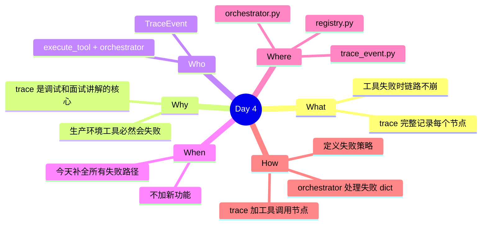

# 第 1 周-第 4 天执行计划：工具调用失败兜底 + trace 完善

## 今日概览

今天让工具调用链路在任何失败场景下都能优雅降级，并在 trace 里留下完整记录。失败策略：把错误信息回填给 LLM，让链路继续跑完。

---

## 任务1：扩展 TraceNodeNames

**预估难度**：低

### 1.1 补充工具调用 trace 节点

在 `app/types/trace_event.py` 里的 `TraceNodeNames` 补充：`TOOL_CALL = "工具调用"`、`TOOL_RESULT = "工具结果回填"`。在 `TraceStatus` 补充：`SKIPPED = "skipped"`。同步更新 `execute_tool` 的返回格式为统一的 `{"status": "success/error", ...}` 结构。

---

## 任务2：失败场景处理

**预估难度**：中

### 2.1 arguments 解析失败

在 orchestrator 遍历 `tool_calls` 时，用 `try/except json.JSONDecodeError` 包裹 `json.loads(arguments)`。解析失败时：trace 记录 TOOL_CALL ERROR，把 `{"error": "参数解析失败"}` 作为工具结果回填，`continue` 到下一个 tool_call。

### 2.2 工具不存在

`execute_tool` 找不到工具名时返回 `{"status": "error", "error": "工具 {name} 未注册"}`。orchestrator 检查 status 字段：error 时 trace 记录 TOOL_CALL ERROR，仍回填错误内容给 LLM。

### 2.3 工具函数抛异常

`execute_tool` 已用 try/except 捕获所有异常，返回 `{"status": "error", "error": str(e)}`。确认 orchestrator 正确处理这个返回值。

---

## 任务3：验证失败场景

**预估难度**：低

### 3.1 构造三种失败用例并验证

在 `scripts/test_tool.py` 里增加：调用不存在的工具名；直接传错误格式的 arguments dict 给 execute_tool；临时在工具函数里加 `raise ValueError("测试")` 后调用。确认每种情况：trace 有 ERROR 节点、TaskResult.status 仍为 success（降级策略）、LLM 返回了降级回答。

---

## 今天不做什么

- 不实现重试机制
- 不区分可重试和不可重试失败
- 不修改 Prompt 减少 LLM 幻觉
- 不实现第二个工具

## 日终验收

- [ ] TraceNodeNames 有 TOOL_CALL 和 TOOL_RESULT 节点
- [ ] 三种失败场景都不崩溃，trace 都有 ERROR 节点
- [ ] 失败后链路继续跑完，LLM 返回降级回答
- [ ] TaskResult.status 在工具失败时仍为 success
