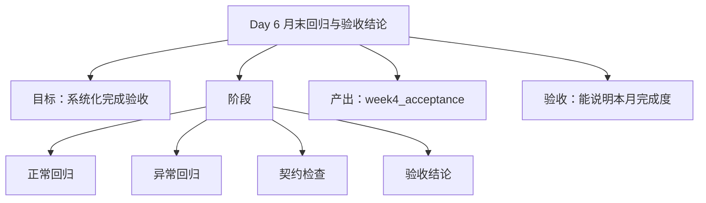

# 第 4 周-第 6 天执行计划：月末回归与验收

## 今日思维导图

## 今日目标
- 用固定样例确认第 4 月得到的确实是一套“后端骨架”，而不是一堆松散功能。
- 覆盖主链路、异常链路、session 连续改写和 trace 可解释性。
- 为 Day 7 的最小文档和第 5 月交接准备证据。

## 前置检查
- 汇总 Day 1-5 的产出，确认今天不新增功能，只做验证和结论整理。
- 列好固定样例：普通任务、工具调用、session 连续改写、异常输入。
- 明确验收标准：主链路稳定、返回结构清晰、trace 可解释、RAG-ready 字段位置稳定。

## 执行步骤
### 步骤 1：整理回归场景清单
- 做什么：按“成功主链路 / 工具调用 / session 连续改写 / 异常场景”分组列出测试场景。
- 具体落点：`evaluation/week4_backend_acceptance.md` 的场景表。
- 完成后产出什么：验收场景清单。
- 怎么验证：这份清单覆盖本周所有主目标，没有只测一两个顺手样例。

### 步骤 2：跑成功主链路样例
- 做什么：验证三类任务至少各有一组样例能稳定返回正确结构。
- 具体落点：主入口与演示入口联调。
- 完成后产出什么：成功样例结果记录。
- 怎么验证：三类任务都能拿到结构化结果，不再有缺环。

### 步骤 3：跑异常场景样例
- 做什么：验证参数缺失、工具失败、空结果或模型异常的返回行为。
- 具体落点：错误结构与最小演示入口。
- 完成后产出什么：异常样例结果记录。
- 怎么验证：失败场景有可读信息，不是直接崩掉或黑盒报错。

### 步骤 4：单独检查 session 连续改写
- 做什么：用 `self_intro_generate` 或最合适任务验证 session 级上下文是否真的生效。
- 具体落点：session 字段、历史窗口、返回结构。
- 完成后产出什么：连续改写验证记录。
- 怎么验证：第二轮输出确实继承前文，而不是重新从零生成。

### 步骤 5：检查 trace 可解释性
- 做什么：随机抽两条请求结果，从 trace 角度审视是否讲得清“发生了什么”。
- 具体落点：trace 节点和 tool trace。
- 完成后产出什么：trace 质量结论。
- 怎么验证：不看代码，也能大致还原系统处理过程。

### 步骤 6：整理验收结论与遗留问题
- 做什么：把通过项、未通过项、遗留问题和下月对接点写清楚。
- 具体落点：`evaluation/week4_backend_acceptance.md`。
- 完成后产出什么：月末验收记录。
- 怎么验证：Day 7 只需要做最小整理，不必重新梳理整周内容。

## 阶段产出
- 月末验收场景清单
- 成功样例记录
- 异常样例记录
- session 连续改写验证记录
- trace 质量结论

## 日终验收
- [ ] 主链路、异常场景、session、trace 都已覆盖
- [ ] 已形成成体系的验收记录，而不是零散测试痕迹
- [ ] 能证明第 4 月成果是一套后端骨架
- [ ] 已整理好遗留问题与第 5 月对接点

## 风险与兜底
- 风险：只测“最顺手”的成功样例，导致验收失真。
- 兜底：强制按四类场景分组验证，不允许只跑 happy path。
- 风险：验收结论只有“可以/不可以”，没有依据。
- 兜底：每个结论都绑定样例和现象，保证可追溯。
