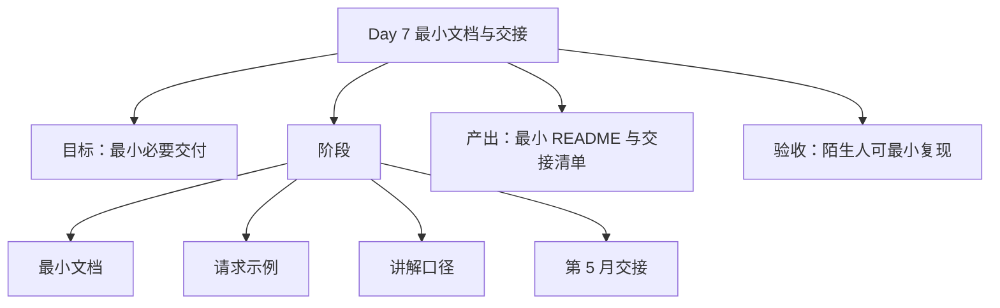

# 第 4 周-第 7 天执行计划：最小文档与第 5 月交接

## 今日思维导图

## 今日目标
- 用最少时间补齐本周必要交付，不回到“重 README / 重包装”的老路上。
- 明确第 5 月从哪里接文档上传、切分、检索和引用来源。
- 形成你自己能拿去讲的第 4 周收口口径。

## 前置检查
- 回看 Day 6 的验收记录，确认今天只做“必要整理”和“明确下一步”。
- 把本周真正需要交付的最小材料列出来：运行说明、请求示例、周结论、第 5 月接口接点。
- 判断哪些内容可以一句话带过，避免重新写成长篇 README。

## 执行步骤
### 步骤 1：整理最小运行说明
- 做什么：写清本地运行方式、必要环境变量、入口位置。
- 具体落点：最小 README 或周文档补充区。
- 完成后产出什么：运行说明。
- 怎么验证：陌生人能按说明启动一次接口或最小 demo。

### 步骤 2：整理最小请求示例
- 做什么：给三类任务各留至少 1 个请求示例，体现统一任务入口。
- 具体落点：请求示例区。
- 完成后产出什么：示例请求集。
- 怎么验证：看示例就能明白调用方式，不需要再翻前面几周笔记。

### 步骤 3：整理 1 分钟和 3 分钟讲解口径
- 做什么：把第 4 周成果讲成“后端骨架建设”，不是“做了个 demo”。
- 具体落点：面试讲解提纲或周总结。
- 完成后产出什么：简版与标准版讲解口径。
- 怎么验证：你能讲清 orchestrator、统一结果结构、trace、RAG-ready 预留这四件事。

### 步骤 4：整理遗留问题与当前边界
- 做什么：把本周没做、故意不做、下月再做的点写明白。
- 具体落点：周结论与风险补充。
- 完成后产出什么：遗留问题清单。
- 怎么验证：后面回看时不会误判“哪些没做是遗漏，哪些没做是刻意取舍”。

### 步骤 5：明确第 5 月 RAG 接入点
- 做什么：把下个月要从哪几个接口、字段、模块开始接 RAG 写具体。
- 具体落点：主协议、检索字段、orchestrator 扩展点。
- 完成后产出什么：第 5 月交接清单。
- 怎么验证：下月一开始就能知道先做文档接入、检索链路还是引用来源，而不是重新想方向。

### 步骤 6：冻结第 4 周结论
- 做什么：把本周形成的最小交付、验收结果和下月接点固定下来。
- 具体落点：周总结或周验收结论。
- 完成后产出什么：第 4 周收口结论。
- 怎么验证：这周可以正式结束，不需要再回头补 Day1-6 的结构性内容。

## 阶段产出
- 最小运行说明
- 三类任务请求示例
- 1 分钟与 3 分钟讲解口径
- 遗留问题清单
- 第 5 月 RAG 接入清单

## 日终验收
- [ ] 已有最小 README 或等价运行说明
- [ ] 已有统一任务入口的请求示例
- [ ] 已形成可直接用于复述的讲解口径
- [ ] 已明确第 5 月从哪几个点接 RAG
- [ ] 没有重新掉进重包装、重长文档的工作模式

## 风险与兜底
- 风险：今天一整理材料，又开始写很多面向展示的包装文案。
- 兜底：只写“能运行、能调用、能交接”的最小内容。
- 风险：下月接点写得太虚，等于没交接。
- 兜底：必须明确到字段、模块或链路，不接受“下月做 RAG”这种空话。
