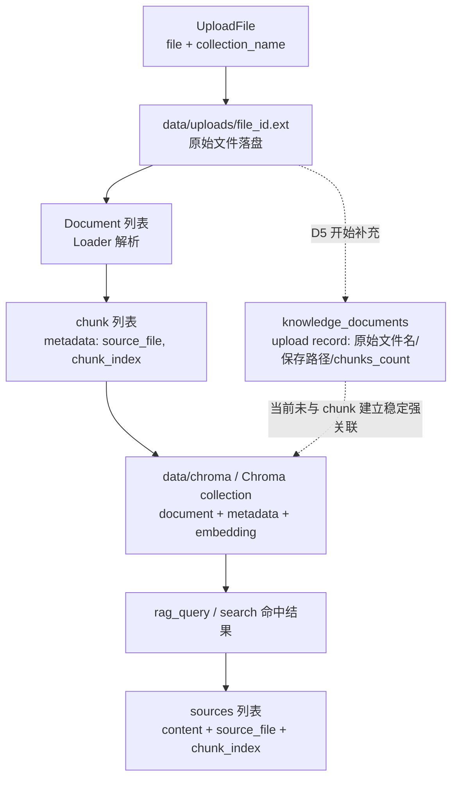

# 设计决策笔记

> 项目开发过程中的技术选型、架构权衡、踩坑解决记录。面试前回顾此文件。

---

### W2-D1 RAG 基础设施选型
- **问题**：W2 需要尽快打通知识库索引、检索和后续生成链路，先确定 RAG 基础设施选型。
- **方案**：使用 `langchain + langchain-openai + chromadb` 作为当前阶段的 RAG 底座。
- **理由**：`langchain` 提供统一的 `Document`、`splitter`、`retriever` 抽象，便于 D2-D4 持续复用；`langchain-openai` 能直接接入现有 OpenAI 兼容环境变量；`chromadb` 支持本地持久化，部署和调试成本低，比一开始上 `PGVector` / `Elasticsearch` 更适合当前学习和原型阶段。

### W2-D1 知识库模块边界
- **问题**：W2 后续会连续扩展向量存储、文档加载、RAG chain 和接口层，需要先固定知识库相关代码的边界。
- **方案**：新增 `app/modules/knowledge_base/` 作为知识库能力模块，先创建模块目录和 `__init__.py`，并将 `data/chroma/`、`data/uploads/` 加入 `.gitignore`。
- **理由**：按业务能力收口比把代码分散到 `services/`、`tools/` 更清晰，也能提前隔离向量索引和上传文件等本地产物，避免后续职责混乱和误提交。

### W2-D1 百炼 Embedding 兼容性适配
- **问题**：阿里云百炼兼容 embeddings 接口与 `langchain_openai` 默认的 token 预切分输入不完全兼容，快速验证时写入 Chroma 失败。
- **方案**：保留百炼兼容接口与 `text-embedding-v4`，在 `OpenAIEmbeddings` 初始化中设置 `check_embedding_ctx_length=False`。
- **理由**：当前项目在上游已经做文档切块，embedding 输入本就应为小块字符串；关闭客户端 token 预切分不影响当前基础 RAG 链路，却能以最小改动适配百炼兼容接口。

### W2-D2 向量存储阶段性选型
- **问题**：W2-D2 既要尽快跑通本地索引与检索链路，又要为后续正式部署保留可演进的向量存储方案。
- **方案**：当前阶段继续使用 ChromaDB 完成原型验证；后续在统一数据库基础设施、服务化部署需求更明确时，再评估迁移到 pgvector。
- **理由**：ChromaDB 嵌入式、依赖轻、调试成本低，适合当前学习和原型阶段；pgvector 更适合复用 PostgreSQL 生态、统一运维与业务数据体系。这次选择是按阶段目标做取舍，不是一开始就引入重型部署。

### W2-D2 检索策略选型
- **问题**：纯向量检索能覆盖语义相似，但对术语、缩写、技能名和精确关键词的命中不够稳定。
- **方案**：当前先保留相似度检索作为基础检索方式，后续演进到“关键词召回 + 向量召回”的混合检索，再统一排序后送入生成链路。
- **理由**：向量检索擅长找“意思接近”的内容，关键词检索擅长找“字面精确匹配”的内容；两路结合通常比纯向量更稳，尤其适合岗位术语和技能名较多的场景。当前先记录演进方向，不把未实现能力写成既成事实。

### W2-D2 文档加载与切块策略
- **问题**：知识库文档格式不一，且 embedding 与检索都要求输入块大小可控、来源可追踪。
- **方案**：在 `document_loader.py` 中先按扩展名选择 Loader，把 PDF、DOCX、TXT、Markdown 统一转成 `Document`，再用 `RecursiveCharacterTextSplitter` 按 `chunk_size=500`、`chunk_overlap=100` 递归分块，并为每个 chunk 补充 `chunk_index` 与 `source_file` 元数据。
- **理由**：这套流程先统一格式，再统一切块粒度，能直接复用到后续向量化与检索；分块时优先保留段落和句子边界，只有超长内容才继续细分，既减少语义断裂，也方便命中后回看文件名与块序号。

### W2-D3 RAG 问答链输出边界
- **问题**：RAG 问答链需要明确非流式、流式与来源信息的职责边界，避免接口层和前端对返回结构产生误解。
- **方案**：`rag_query()` 在无检索结果时直接短路，返回固定兜底文案和空 `sources`；`rag_query_stream()` 当前只输出文本 chunk，不在流式路径返回 `sources`；`sources` 仅由检索层的 `Document` 元数据构造，字段保持为 `content`、`source_file`、`chunk_index`。
- **理由**：这样可以保持流式链路轻量、来源信息稳定可追溯，并避免把模型生成内容和引用元数据耦合在一起，方便后续在 D4 路由层单独扩展 SSE 事件结构。

### W2-D4 Upload 数据形状与落点
- **问题**：文件上传链路同时涉及 HTTP 参数、本地文件、文档块、向量库记录和查询来源，若不先明确“数据形状怎么变、去了哪里”，后续路由实现和来源展示很容易混淆。
- **方案**：将 upload 链路固定为 `UploadFile -> data/uploads/ 原文件 -> Document[] -> chunk[] + metadata(source_file, chunk_index) -> Chroma collection records -> query sources[]`，并在 D5 开始补上 `knowledge_documents` 这条文件级 upload record 分支。当前原文件保存在 `data/uploads/`，chunk 文本、metadata 与 embedding 持久化到 `data/chroma/`；查询命中后再由 `rag_query()` 将检索结果映射成 `sources`。当前 `sources.source_file` 指向保存后的文件名体系，`knowledge_documents` 负责记录这次上传对应的原始文件名、保存路径与分块结果，但尚未和 chunk 建立稳定强关联。
- **理由**：这条链把“HTTP 接收”“文件落盘”“分块”“向量化”“来源展示”“上传记录”拆成清晰阶段，既方便理解 D4/D5 的职责分界，也便于后续定位问题时判断数据当前停留在哪一层，以及当前哪些关联已经存在、哪些仍是后续增强项。

### W2-D4 可追溯性边界
- **问题**：知识库问答需要“可展示来源”，但 D4 的目标是先打通上传、检索和 SSE 路由；如果在这一天同时引入完整 upload record、document 级标识和 chunk 强关联，范围会从路由编排扩成数据模型设计。
- **方案**：D4 采用弱追溯：chunk metadata 只保留 `source_file` 与 `chunk_index`，查询结果只承诺返回这两级定位信息；强追溯延后到 D5 及之后，再通过 `knowledge_documents` / upload record 为文件级与 chunk 级关系补上稳定锚点。
- **理由**：弱追溯已经足够支持“命中了哪个文件的第几个块”，能满足当前学习和最小 RAG 演示；把强追溯后置，可以避免在 D4 提前承诺尚未落地的数据库字段与关联关系，同时保持 `ChromaDB（当前）-> pgvector（后续演进）` 的路线不变。

### W2-D4 query / query_stream 执行边界
- **问题**：知识库已经同时具备非流式 `rag_query()` 与流式 `rag_query_stream()`，但两者在“什么时候返回结果”“返回什么形状”“检索阶段是否并行”上很容易被混淆，进而影响路由层实现与前端预期。
- **方案**：固定这两条链路的边界：`rag_query()` 走“先检索 -> 一次性生成 -> 返回 `answer + sources`”；`rag_query_stream()` 走“先检索 -> 再流式生成 -> 逐 chunk 输出文本”。当前流式路径只负责回答文本，不返回 `sources`；如果后续要在 `/kb/query/stream` 中展示来源，应在路由层单独扩展 SSE 事件结构，而不是把现有 `rag_query_stream()` 误当成完整 JSON 返回接口。
- **理由**：非流式与流式的核心差异不在“函数名不同”，而在控制流和输出契约不同。非流式天然适合一次性返回结构化结果；流式则更适合把模型输出按 chunk 推送给前端。先把职责边界固定，后续接 `/kb/query/stream` 路由时就不会把文本流、来源信息和结束信号混成一个返回体。

### W2-D4 流式 query 的异步语义
- **问题**：`rag_query_stream()` 中用了 `await asyncio.to_thread(search, ...)`，容易误以为“检索和生成是并行的”或“search 已经变成原生异步函数”。
- **方案**：明确当前流式 RAG 的执行顺序仍然是“先检索，后生成”。其中 `search(...)` 本身仍是同步阻塞函数，只是通过 `asyncio.to_thread(...)` 被派发到线程池执行；当前协程异步等待检索结果返回，拿到完整 `documents` 后，才进入 `chain.astream(...)` 的逐 chunk 流式生成阶段。
- **理由**：这样做的目的不是让检索和生成并行，而是避免同步检索阻塞事件循环。对当前请求来说，仍然必须先等检索完成，才能拼接 context 并开始生成；但对整个 FastAPI 服务来说，事件循环线程不会被同步检索卡死，仍能继续调度其它协程与流式响应。

### W2-D4 /kb/collections 的观测口径
- **问题**：`/kb/collections` 既可以从数据库里的 `knowledge_documents` 理解为“上传过什么文件”，也可以从 Chroma 理解为“向量库里当前实际有什么 collection”，如果不先固定口径，接口会把业务记录和索引状态混在一起。
- **方案**：`/kb/collections` 作为纯读接口，直接访问 `chromadb.PersistentClient(path="./data/chroma")`，通过 `list_collections()` 列出当前 Chroma 中的 collection，并返回每个 collection 的 `name` 与 `count()`；不从 `knowledge_documents` 表推导 collection 列表。
- **理由**：这个接口要回答的是“当前向量库的真实状态”，而不是“业务上记录过哪些上传行为”。`knowledge_documents` 记录的是文件级 upload record，`collection.count()` 统计的是 collection 中实际存放的 document/chunk 记录数。两者口径不同，直接读 Chroma 才能准确反映当前可检索的索引状态。

### W2-D4 知识库路由集成方式
- **问题**：D4 需要把 upload、query、query/stream、collections 四个接口正式接入 FastAPI 主应用，同时明确流式接口在 HTTP 层的最小协议；否则即使底层能力已实现，`/docs` 和实际请求也无法稳定反映当前知识库能力。
- **方案**：新增 `app/modules/knowledge_base/router.py` 作为知识库接口层，并在 `app/main.py` 中通过 `app.include_router(kb_router)` 统一注册。`/kb/query/stream` 在路由层使用 `EventSourceResponse` 包装 `rag_query_stream()`，当前协议固定为两类 SSE 事件：逐 chunk 输出 `event: message`，结束时输出 `event: done` + `[DONE]`；本轮不在流式路径返回 `sources`。
- **理由**：把知识库接口收口到独立 router，能保持 `main.py` 只负责应用入口和路由挂载，避免把知识库细节塞回主文件；同时先固定最小 SSE 协议，可以让流式链路稳定可测，不把文本流、来源信息和结束信号混成一个返回体。

### W2-D4 upload 手工调试与验收口径
- **问题**：`/kb/upload` 第一次手工测试返回 500，后续又出现"Swagger UI 里看起来失败，但数据库记录和落盘文件显示实际成功"的现象，如果不区分"真实服务端失败"和"手工观测口径不可靠"，很容易误判 D4 仍被 upload 阻塞。
- **方案**：先按服务端真实链路排查 upload 500。最终确认第一次稳定失败的根因是本地 `job_copilot.db` 中 `knowledge_documents` 仍停留在占位表结构，缺少 `filename`、`collection_name`、`file_path`、`file_hash`、`chunks_count`、`status`、`file_size` 等字段；修复路径采用 Alembic 对齐本地版本：先把数据库 `stamp` 到已存在的占位迁移，再生成并应用补字段迁移。修复后，将 upload 的手工验收口径固定为"以服务端可观测结果为准"：同时检查 HTTP 响应、`knowledge_documents` 记录、`data/uploads/` 落盘文件，而不是只看 Swagger UI 中的单一展示结果。
- **理由**：这次故障先是标准的数据库 schema 落后问题，根因在 ORM 模型与本地实际表结构不一致；它修好后，服务端真实链路已经能成功完成"落盘 -> 分块 -> 向量写入 -> 记录入库"。Swagger UI 的示例 curl 只是文档展示，不是浏览器真实发包的精确回显；而 UI 中单次显示结果若和数据库记录、上传文件痕迹冲突，应优先相信服务端状态。把手工验收口径明确成"响应 + 数据库 + 文件系统"三点交叉验证，能避免把文档展示噪音误判成接口本身失败。

### W2-D5 上传幂等判重：(collection_name, file_hash) 唯一约束
- **问题**：同一份文件重复上传会重复调用 embedding API（费用浪费）、写入重复向量记录、数据库出现多条相同 hash 的 upload record；如果不在数据层拦截，重复上传只能靠前端防抖或人工约束。
- **方案**：在 `knowledge_documents` 表上新增 `UniqueConstraint("collection_name", "file_hash", name="uq_kb_collection_hash")`；upload 接口先计算文件 SHA-256 hash，再查 DB 是否已有 `status=completed` 的同 hash 记录——命中则直接返回 `reused: true` 并跳过 embedding；未命中再走正常写入流程。
- **理由**：唯一约束把判重责任下沉到数据库层，即使应用层查询-写入之间存在并发窗口，约束依然能兜底。hash 前移到写入前计算，虽然多了一次文件读取，但相比 embedding API 调用的成本微乎其微。`reused` 字段显式返回让调用方知道本次上传是真实处理还是缓存命中。

### W2-D5 两阶段 commit：uploading → completed
- **问题**：D4 的 upload 流程是"先写向量、后写 DB 记录"，如果向量写入成功但 DB 提交失败，向量库里会留下脏数据需要补偿删除；但如果反过来"先写 DB、再写向量"，DB 记录会短暂处于 completed 状态而实际向量还没落地，造成查询时检索为空。
- **方案**：引入两阶段 commit 模式。第一次 commit 写入 `status=uploading` 的占位记录；然后执行分块与向量写入；第二次 commit 把 status 更新为 `completed`。如果中间任何一步失败，走不同的补偿路径：`ValueError`（格式不支持）→ 删除占位 + 400；其他异常 → 保留 `status=failed` 记录 + 补偿删除向量 + 500。
- **理由**：占位记录让唯一约束对并发请求立即生效（第二个请求的 commit 会触发 `IntegrityError` → 409）；`failed` 记录保留便于排查失败原因和后续批量清理，比直接删除更可观测。两阶段模式虽然多一次 DB 往返，但把"数据一致性窗口"从整个上传过程缩短到了两次 commit 之间，是当前 SQLite 单进程场景下最小代价的方案。

### W2-D5 Orchestrator RAG 上下文注入
- **问题**：`TaskResult` 已预留 `retriever_context` 字段，但 orchestrator 一直没有真正从知识库检索上下文填充它；如果不实现注入点，前端/下游永远拿不到 RAG 检索结果，知识库模块和任务系统之间就只有"各自独立"的状态。
- **方案**：在 orchestrator 中新增 `_build_retriever_context(payload, top_k=3)` 函数，仅当 payload 同时包含 `use_rag=True`、`rag_collection` 和 `rag_question` 三个参数时才调用 `kb_search` 获取检索结果，构造 `RetrieverContext` 并注入 `TaskResult.from_success`（from_success 新增可选 `retriever_context` 参数）。检索失败不拖垮主任务，返回 `status="error"` 的空上下文。
- **理由**：三要素齐全才触发，避免在不需要 RAG 的任务类型上产生无效检索开销和意外报错。检索失败降级而非阻塞，符合"辅助增强而非核心依赖"的 RAG 定位。`from_success` 接受可选参数而非全量重构，保持向后兼容。

### W2-D5 failed 记录可重试：重传前清理 failed 占位
- **问题**：`status=failed` 的记录占住 `(collection_name, file_hash)` 唯一约束名额；用户重传同文件时，新的 `uploading` 占位 commit 会触发 `IntegrityError` 并返回 409，形成"失败后永远无法重试"的死状态。
- **方案**：在创建 `uploading` 占位之前，先 `DELETE` 同 `(collection_name, file_hash)` 且 `status=failed` 的记录并 commit，释放约束名额后再走正常两阶段流程。
- **理由**：`failed` 记录的排查价值在"被新一次上传覆盖前"——一旦用户主动重传，说明已知晓失败并决定重试，旧 failed 记录不再有保留必要。先删后插比 `UPDATE` 更简单，也避免了复用旧记录的 `file_path` 字段指向已被清理的文件路径。